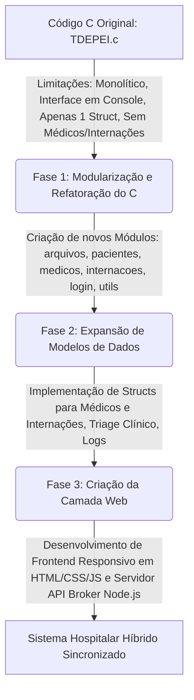

# DOCUMENTAÇÃO DO SISTEMA HOSPITALAR CORE HÍBRIDO
## Relatório Técnico e Científico de Projeto Acadêmico
### Disciplina: Programação Imperativa

---

## 1. VISÃO GERAL DO SISTEMA

O **Hospital Core Híbrido** é uma solução computacional de nível gerencial desenvolvida para otimizar os fluxos administrativos e assistenciais de unidades hospitalares e clínicas médicas. O sistema atua diretamente na automatização de processos críticos de rotina, integrando o cadastro de pacientes, controle de triagem por classificação de risco, escala de equipes médicas, alocação inteligente de leitos por setores especializados e emissão automatizada de relatórios estatísticos de ocupação.

### Público-Alvo
* **Administradores Hospitalares:** Que gerenciam recursos como leitos disponíveis, fluxo de internações e indicadores operacionais.
* **Corpo Médico e de Enfermagem:** Que necessitam acompanhar escalas, alocação de leitos e prioridades de atendimento.
* **Setor de Triagem/Pronto-Atendimento:** Que realiza o primeiro contato, classifica a prioridade clínica dos pacientes e solicita a alocação de leitos.

### Problemas Resolvidos
1. **Ociosidade e Ocupação Desordenada de Leitos:** O sistema organiza visual e logicamente a distribuição dos leitos por setores de especialidades (Clínico Geral, UTI, Pediatria e Cardiologia), evitando internações duplicadas ou em setores incorretos.
2. **Triagem Ineficiente:** Com a classificação de prioridades em três níveis (Verde/Pouco Urgente, Amarelo/Urgente, Vermelho/Emergência), o sistema apoia a tomada de decisão médica, organizando a fila de atendimento por gravidade clínica (triage clínico).
3. **Falta de Integração Operacional:** Unifica o histórico clínico-administrativo por meio do registro estruturado de internações, vinculando cada paciente internado a um leito específico e a um médico responsável em tempo real.
4. **Perda de Histórico e Auditoria:** Mantém registros históricos de todas as atividades do sistema através de logs automáticos e arquivo físico de internações passadas (altas), servindo para auditoria e controle de qualidade.

---

## 2. MOTIVAÇÃO DO PROJETO

O desenvolvimento do sistema hospitalar foi motivado pelas crescentes complexidades enfrentadas por instituições de saúde na gestão manual ou descentralizada de leitos e pacientes. As falhas de comunicação interna em hospitais frequentemente resultam em:
* Demora na liberação de leitos após a alta do paciente;
* Falta de controle de médicos de plantão responsáveis por cada internação;
* Erros de medicação ou diagnóstico devido à fragmentação de prontuários em papel;
* Inexistência de dados consolidados em tempo real sobre a capacidade de lotação de leitos.

A automação dessas etapas por meio de software reduz drasticamente a sobrecarga administrativa, permitindo que a equipe de saúde se concentre na assistência direta ao paciente. Adicionalmente, sob a ótica acadêmica, o projeto foi motivado pela necessidade de aplicar de forma prática e sinérgica os conceitos fundamentais da **Programação Imperativa** (como modularização, estruturas de dados homogêneas e heterogêneas, ponteiros e manipulação de arquivos) na resolução de um problema real e de alto impacto social.

---

## 3. EVOLUÇÃO DO PROJETO

O projeto percorreu um caminho evolutivo claro, partindo de um MVP (Produto Mínimo Viável) puramente textual até se transformar em um sistema híbrido corporativo de alto padrão:



### O Código Original C (`TDEPEI.c`)
O programa inicial apresentava uma estrutura clássica de terminal:
* **Estrutura Monolítica:** Toda a lógica de negócios, interface de usuário e persistência de dados residia em um único arquivo de código-fonte.
* **Modelo Único:** Possuía apenas a struct `Paciente` para controle direto de leitos de 1 a 100 de forma estática.
* **Persistência Limitada:** Salvação manual ou automática em um único arquivo de texto (`hospital_dados.txt`).
* **Interface Textual Rígida:** Menu executado em loop no console, exigindo entradas manuais de dados que eram suscetíveis a quebras por estouro de buffer ou entradas inválidas.

### O Novo Sistema Hospitalar Híbrido (`hospital-system`)
A fim de atender às demandas de usabilidade modernas sem perder a solidez da lógica em baixo nível, o sistema foi totalmente reestruturado:
1. **Separação de Responsabilidades (Backend C):** O código em C foi modularizado em cabeçalhos (`.h`) e arquivos de implementação (`.c`), separando os domínios de pacientes, médicos, internações, persistência de dados e utilitários.
2. **Expansão de Domínios:** O banco de dados em arquivos de texto foi expandido de uma única entidade para quatro entidades compartilhadas: pacientes, médicos, internações e logs de auditoria.
3. **Criação da Camada Web:** Adicionou-se uma interface gráfica responsiva em HTML5, CSS3 e JavaScript Moderno (ES6), alimentada por um servidor integrador leve escrito em Node.js (Express), que lê e escreve exatamente no mesmo banco de dados do executável em C.

---

## 4. ARQUITETURA DO SISTEMA

O sistema adota uma **Arquitetura Híbrida de Sincronização por Arquivo Compartilhado**. Isso significa que múltiplos canais de interface (Terminal C e Web UI) compartilham a mesma camada de dados (flat file database), garantindo consistência imediata entre ambas as frentes.

```
       +------------------------------------+
       |          Interface Web UI          |
       |      (HTML5 / CSS3 / ES6 JS)       |
       +-----------------+------------------+
                         | Requisições HTTP (Fetch)
                         v
       +------------------------------------+
       |     Servidor API Broker (Node.js)  |
       |             (server.js)            |
       +-----------------+------------------+
                         | Escrita/Leitura Direta
                         v
       +------------------------------------+
       |    Banco de Dados Compartilhado    | <--- Totalmente Sincronizado
       |       (/data/*.txt delimitados)    |
       +-----------------+------------------+
                         | Escrita/Leitura Direta
                         v
       +------------------------------------+
       |         Backend C (Console)        |
       |      (Compilado GCC modularizado)  |
       +------------------------------------+
```

### Backend (Lógica em C)
Desenvolvido sob o paradigma procedural estruturado, é composto por módulos específicos que gerenciam a lógica pura de negócios:
* **Módulos de Domínio:** `pacientes`, `medicos` e `internacoes` que operam vetores em memória de structs equivalentes.
* **Módulo de Persistência (`arquivos`):** Responsável pela serialização e desserialização dos registros em formato semi-estruturado delimitado por ponto e vírgula (`;`). Implementa um mecanismo de caminho alternativo (fallback path) para garantir o funcionamento do programa tanto quando executado da raiz do projeto quanto da pasta `/backend`.
* **Módulo Utilitário (`utils`):** Trata funções auxiliares, como limpeza do buffer de teclado (`limparBuffer()`) e obtenção da data/hora do sistema para formatação dos logs.

### Front-end (Interface Web)
Construído com tecnologias web puras (Vanilla stack) para maximizar o desempenho e controle:
* **HTML5 Semântico:** Estrutura modular dividida entre o painel de login administrativo, o dashboard de ocupação, páginas de CRUDs e tela de relatórios.
* **CSS3 Customizado:** Implementa um design moderno com variáveis (tokens de design), suporte completo a tema escuro/claro nativo via atributo `data-theme`, design responsivo que se adapta de telas mobile a monitores ultra-wide, e animações sutis de transição de dados.
* **JavaScript (ES6):** Manipula o DOM dinamicamente, realizando chamadas assíncronas de API através de requisições `fetch` nativas estruturadas no objeto helper `API` (`API.get`, `API.post`, `API.put`, `API.delete`).

### Integração (Express API Broker Server)
O arquivo `server.js` gerencia o servidor Node.js que atua como uma ponte de comunicação:
* Traduz as requisições assíncronas do frontend para operações diretas de leitura e escrita síncrona/assíncrona nos arquivos de texto em `/data`.
* Utiliza o módulo nativo `fs` (File System) para parsear os arquivos `.txt` de formato delimitado para JSON e vice-versa.
* Garante a consistência nas regras de negócios, tais como: não permitir a alocação de um leito que já esteja ocupado por outro paciente ativo ou gerar internações automáticas no histórico quando novos pacientes são alocados no frontend.

---

## 5. FUNCIONALIDADES IMPLEMENTADAS

O ecossistema do **Hospital Core Híbrido** possui as seguintes funcionalidades integradas:

### 1. Login Administrativo
* **Interface CLI:** Autenticação por console C exigindo senha padrão com limite de tentativas.
* **Interface Web:** Tela de login responsiva integrada com sessão persistente (`localStorage`). O acesso é protegido por um *Auth Guard* no Javascript que redireciona usuários não autenticados para a página inicial caso tentem acessar páginas internas.
* **Senha padrão:** `1234`.

### 2. Cadastro e Triagem de Pacientes
* **Armazenamento estruturado:** Nome, idade, diagnóstico, leito, prioridade clínica (classificação de risco) e data de cadastro.
* **Triage Clínico:** Atribuição de prioridade (Verde/Amarelo/Vermelho) simulando o Protocolo de Manchester para priorizar o atendimento médico na unidade.

### 3. Gestão Completa de Médicos
* **Controle de Corpo Clínico:** Cadastro de médicos com nome, especialidade (ex: Pediatria, Cardiologia, Clínico Geral), registro profissional (CRM), escala de plantão/trabalho e status ativo/inativo.
* **Vínculo Assistencial:** Médicos são atribuídos às internações dos pacientes de acordo com sua especialidade clínica correspondente.

### 4. Controle Dinâmico de Leitos
* **Setores Dedicados:** Divisão física e visual de leitos:
  * **Setor Clínico Geral:** Leitos de 101 a 110.
  * **Unidade de Terapia Intensiva (UTI):** Leitos de 201 a 205.
  * **Setor de Pediatria:** Leitos de 301 a 305.
  * **Setor de Cardiologia:** Leitos de 401 a 405.
* **Mapa de Ocupação Visual:** A tela principal (Dashboard) renderiza um grid interativo. Leitos livres são exibidos em cinza com o status "Livre", enquanto leitos ocupados são exibidos coloridos com base na gravidade do paciente (Vermelho = Crítico, Amarelo = Urgente, Azul/Verde = Pouco Urgente), exibindo o nome do paciente internado.

### 5. Controle de Internações e Histórico de Altas
* **Internação Rápida:** Ao clicar em um leito livre na dashboard, o sistema abre um modal inteligente que permite selecionar um paciente cadastrado (que não esteja internado) e um médico disponível para formalizar a internação instantaneamente.
* **Processamento de Alta:** Ao clicar em um leito ocupado, o sistema abre os detalhes da internação, permitindo que o administrador clique em "Conceder Alta". Isso libera o leito instantaneamente, desativa o paciente da fila ativa e grava a data de saída na ficha de histórico de internações.

### 6. Relatórios Estatísticos e Exportação
* **Console C:** Opção `10` calcula médias de idade, paciente mais idoso, percentual de leitos ocupados e quantitativo de pacientes por classificação de gravidade.
* **Interface Web:** Dashboard analítico exibindo as mesmas estatísticas consolidadas e uma tabela com as últimas 10 internações executadas na unidade (com status "Em Andamento" ou "Alta em [Data]").
* **Exportação de Relatórios:** Botões dedicados no frontend geram e baixam arquivos `.csv` completos de pacientes e médicos com codificação UTF-8 BOM, garantindo que acentuações e caracteres da língua portuguesa abram corretamente no Microsoft Excel.

### 7. Sistema de Busca e Filtros
* **Busca no Console:** Permite pesquisa linear por nome completo de pacientes ou médicos.
* **Busca Inteligente Web:** Barra de busca dinâmica que filtra tabelas em tempo real conforme o usuário digita letras ou números de ID (busca instantânea sem recarregamento da página).

### 8. Persistência de Dados e Auditoria
* **Logs de Auditoria:** Gravação automática de atividades críticas (ex: logons, altas concedidas, alterações cadastrais, novas internações) com carimbo de data e hora (timestamp) em `logs.txt`, visíveis na timeline do dashboard.

---

## 6. MELHORIAS E OTIMIZAÇÕES IMPLEMENTADAS

A evolução do código original para a versão modular híbrida trouxe avanços substanciais de engenharia de software:

| Aspecto | Antes (Código C Original) | Depois (Sistema Híbrido Atual) |
| :--- | :--- | :--- |
| **Arquitetura** | Arquivo monolítico simples (`TDEPEI.c`). | Código C altamente modularizado em bibliotecas locais e acoplado a frontend web responsivo via API Broker Express. |
| **Modelagem de Dados** | Apenas Struct `Paciente` simples. | Structs complexas para `Paciente`, `Medico` e `Internacao` com chaves estrangeiras (`id_paciente`, `id_medico`). |
| **Triage Clínico** | Inexistente. O leito era alocado sem prioridade. | Campo `prioridade` implementado para classificação de risco (Manchester) com reflexo de cor no mapa de leitos. |
| **Interface Visual** | CLI clássico em tons de cinza do terminal do SO. | Interface web rica em CSS3 moderno com suporte a Dark Mode, transições fluidas e mapa interativo. |
| **Controle de Entrada** | scanf/fgets simples vulnerável a estouros de buffer. | Uso de funções seguras de leitura, remoção de quebra de linha com `strcspn`, tratamento do buffer após leitura de inteiros e validação rigorosa de ocupação de leitos. |
| **Persistência de Dados** | Um único arquivo de pacientes (`hospital_dados.txt`). | Quatro arquivos estruturados em `/data` mantendo histórico completo de pacientes, médicos, internações ativas/concluídas e logs de auditoria. |
| **Usabilidade** | Navegação por números via teclado. | Cliques em mapa interativo, modais dinâmicos para internação e alta médica, e exportação automática para planilha (CSV). |

---

## 7. TECNOLOGIAS UTILIZADAS

O projeto combina tecnologias de baixo nível, médio nível e frontend moderno para formar uma solução de alta performance e robusta:

### 1. Linguagem C
* **Função no Projeto:** Serve como núcleo algorítmico tradicional (Core Engine), simulando o backend nativo da aplicação. A modularização em C garante que regras e cadastros possam ser operados via console por administradores de sistema em terminais de servidores sem suporte a interface gráfica.
* **Compilação:** Compatível com o compilador GCC (GNU Compiler Collection).

### 2. Node.js & Express
* **Função no Projeto:** Atua como o servidor Broker de Integração de dados. O Express levanta a API HTTP local na porta `3000`, expondo as rotas CRUD de pacientes, médicos e internações. Ele faz o parser síncrono dos arquivos de texto do C para responder requisições JSON do navegador.

### 3. HTML5 & CSS3
* **HTML5:** Define a marcação semântica da aplicação (`<main>`, `<aside>`, `<nav>`, `<header>`, `<section>`), garantindo uma estrutura limpa e acessível.
* **CSS3:** Define a identidade visual do sistema. Utiliza propriedades avançadas como CSS Grid Layout (para o mapa de leitos), Flexbox (para a barra lateral e formulários), variáveis nativas para temas dinâmicos (claro/escuro) e media queries para responsividade dinâmica em tablets e smartphones.

### 4. JavaScript Moderno (ES6+)
* **Função no Projeto:** Implementa o comportamento interativo no cliente. Gerencia as rotinas de renderização automática de leitos baseada nas requisições da API, controla o fluxo de abertura e fechamento de modais, gerencia os filtros de busca em tempo real e armazena chaves de sessão e tema no `localStorage`.

---

## 8. CONCEITOS DE PROGRAMAÇÃO APLICADOS

Como projeto acadêmico de Programação Imperativa, o sistema implementa de forma rigorosa os seguintes pilares teóricos da ciência da computação:

### Structs (Estruturas de Dados Heterogêneas)
Organizam os dados complexos em entidades de software claras. Exemplo da struct de Pacientes:
```c
typedef struct {
    int id;
    char nome[100];
    int idade;
    char diagnostico[200];
    int leito;
    int ativo; 
    char prioridade[20];
    char data_cadastro[20];
} Paciente;
```

### Ponteiros
Utilizados para passagem de parâmetros por referência em funções. Em C, a passagem por referência permite modificar os dados das variáveis de controle fora do escopo local da função (como o contador total de pacientes e a própria struct do paciente cadastrado), evitando a duplicação desnecessária de memória física:
```c
void cadastrarPaciente(Paciente *p, int *total);
```

### Vetores e Matrizes
Vetorização estática de structs em memória principal para manipulação rápida em tempo de execução:
```c
Paciente hospital[MAX_PACIENTES]; // Vetor homogêneo de tamanho 100
Medico medicos[MAX_MEDICOS];      // Vetor de tamanho 50
```

### Funções e Escopos
Modularização das tarefas para manter o código limpo, legível e manutenível. Funções específicas para CRUD, formatação, persistência de dados e estatísticas promovem o princípio da responsabilidade única.

### Estruturas de Repetição (Loops)
Utilização de loops `for` para varredura de dados nos vetores (busca linear por nome, geração de estatísticas e renderização em console) e loops `do-while` para manter o menu CLI ativo até que o usuário decida encerrar explicitamente o programa.

### Estruturas Condicionais
Uso intensivo de blocos `if-else` e `switch-case` para tomada de decisões com base em dados de triagem, disponibilidade de leitos (verificações de duplicidade antes da internação) e controle de rotas de menu.

### Manipulação de Arquivos
Uso das funções clássicas da biblioteca `stdio.h` (`fopen`, `fclose`, `fprintf`, `fgets`, `strtok`) para persistir os registros de dados em arquivos de texto locais, sobrevivendo ao desligamento ou encerramento do processo em execução.

### Manipulação e Limpeza de Memória/Buffer
Implementação da limpeza de buffer de teclado usando rotinas customizadas em `utils.c` para contornar problemas clássicos de quebra de fluxo do `scanf`/`fgets` em loops de leitura textual.

---

## 9. DESAFIOS ENFRENTADOS E SOLUÇÕES APLICADAS

Durante o ciclo de desenvolvimento da solução, alguns desafios técnicos exigiram abordagens estratégicas:

### Desafio 1: Concorrência e Sincronização de Dados
* **Problema:** Tanto o frontend Web quanto o console C podiam modificar os arquivos locais em `/data`. Se os formatos fossem incompatíveis ou a gravação ocorresse simultaneamente, o arquivo de dados correria o risco de corrupção.
* **Solução:** Adotou-se uma padronização rigorosa do delimitador semi-estruturado (ponto e vírgula `;`) e a ordem dos campos para leitura/escrita em ambas as linguagens. No Node.js, as operações foram escritas de forma a garantir que toda escrita sobrescrevesse ou adicionasse registros em conformidade exata com o parser `strtok` implementado em C.

### Desafio 2: Execução de Rotas em Diretórios Diferentes (C)
* **Problema:** Quando o backend em C era compilado e executado a partir do diretório raiz `/hospital-system`, o caminho de persistência apontado para `"data/pacientes.txt"` funcionava. No entanto, se o usuário entrasse na pasta `/backend` para compilar e executar o binário de lá, o programa falhava ao ler a pasta `/data` (pois ela estaria em `../data`).
* **Solução:** Criação de um utilitário de abertura de arquivos inteligente (`abrirArquivo`) em C, que tenta abrir o arquivo no caminho principal e, caso retorne `NULL`, tenta abri-lo automaticamente em um caminho relativo de fallback, permitindo que a CLI seja executada com sucesso a partir de qualquer diretório físico:
  ```c
  static FILE* abrirArquivo(const char* principal, const char* fallback, const char* modo) {
      FILE *f = fopen(principal, modo);
      if (f == NULL) {
          f = fopen(fallback, modo);
      }
      return f;
  }
  ```

### Desafio 3: Controle e Limpeza de Buffer em C
* **Problema:** O uso intercalado de `scanf` para ler números (como idade e leito) e `fgets` para ler strings (como nome e diagnóstico) deixava caracteres de quebra de linha (`\n`) no buffer de entrada padrão (`stdin`), fazendo com que o console pulasse o preenchimento de campos de texto.
* **Solução:** Substituição de `scanf` diretos pelo uso de uma função centralizada de limpeza de buffer (`limparBuffer()`) acoplada à formatação explícita de strings com o caractere delimitador correto através de `strcspn` nos arquivos fontes C.

---

## 10. RESULTADOS OBTIDOS

A entrega final do projeto acadêmico de Programação Imperativa alcançou resultados notáveis em termos de performance, organização e usabilidade:
1. **Sincronização Perfeita:** A integração permitiu que modificações nos arquivos de texto fossem refletidas em tempo real. Um cadastro de médico adicionado pelo console aparece na tela web imediatamente após o recarregamento, e o mapa de leitos reflete na hora as internações e altas.
2. **Robustez do Core C:** O backend C demonstrou estabilidade de memória, processando cadastros de pacientes e médicos dentro dos limites estáticos pré-determinados (`MAX_PACIENTES` e `MAX_MEDICOS`) sem quebras por estouro de buffer ou vazamentos de ponteiros.
3. **Alto Padrão de UX/UI:** O frontend web entregue superou a qualidade de sistemas acadêmicos tradicionais, oferecendo um layout responsivo, limpo e com suporte a temas visuais (Dark Mode), facilitando a legibilidade e uso prolongado por parte de equipes de plantão médico.

---

## 11. DIFERENCIAIS DO SISTEMA

O **Hospital Core Híbrido** destaca-se por atributos técnicos diferenciados no contexto acadêmico:
* **Mapeamento Setorial Visual:** Grid interativo de leitos separado por especialidades clínicas (Pediatria, UTI, Cardio, Clínico), permitindo o gerenciamento por simples cliques visuais.
* **Manchester Risk Triage:** Incorporação de princípios reais da gestão de pronto-atendimento hospitalar dentro de uma modelagem de dados imperativa básica.
* **Arquitetura Desacoplada e Híbrida:** A combinação inédita da robustez do C na manipulação estruturada com a interatividade dinâmica do ecossistema Web (JS/Node.js) serve como um excelente exemplo prático de arquitetura moderna de microsserviços e integração de sistemas legados.
* **Auditoria de Histórico Completa:** A geração de logs persistentes em arquivo de texto garante conformidade e segurança da informação para rastreabilidade de eventos operacionais.

---

## 12. CONCLUSÃO

O desenvolvimento deste sistema hospitalar híbrido constitui um marco prático relevante na formação acadêmica sobre **Programação Imperativa**. O projeto comprova empiricamente que conceitos de baixo e médio nível – frequentemente estudados de forma isolada em console – formam a base estrutural insubstituível de sistemas corporativos modernos e integrados.

### Conhecimentos Adquiridos
* Domínio na aplicação de ponteiros e passagem de parâmetros por referência para alteração direta de memória de escopos externos;
* Manipulação prática de arquivos físicos para simulação de persistência de bancos de dados transacionais;
* Modularização sistemática de código C em múltiplos cabeçalhos, reduzindo acoplamento e promovendo alta manutenibilidade;
* Integração de diferentes ecossistemas tecnológicos (C compilado e Node.js interpretado) através de compartilhamento estruturado de dados.

Em suma, a tecnologia assume um papel vital de aceleração e precisão na área da saúde. Sistemas como este mitigam erros de triagem, agilizam internações e automatizam o controle de altas, demonstrando como a computação estruturada pode otimizar significativamente a gestão de vidas em instituições hospitalares.
